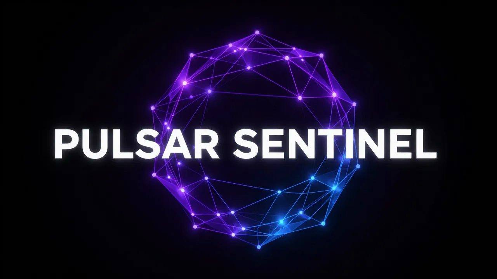

<div align="center"></div>

[](https://github.com/thebardchat/constitution)

# PULSAR SENTINEL

**Post-Quantum Cryptography Security Framework for Angel Cloud**

A production-grade blockchain-integrated security layer providing quantum-resistant encryption, immutable audit trails, and self-governance for the 800M Windows users facing security update deprecation.

This project operates under the [ShaneTheBrain Constitution](https://github.com/thebardchat/constitution/blob/main/CONSTITUTION.md).

---

## Infrastructure

All thebardchat repos run on a single Raspberry Pi 5 + Pironman 5-MAX with NVMe RAID 1.

| Component | Details |
|-----------|---------|
| **Compute** | Raspberry Pi 5, 16GB RAM |
| **Chassis** | Pironman 5-MAX by Sunfounder |
| **Storage** | RAID 1 — 2x WD Blue SN5000 2TB NVMe (mdadm) |
| **Core Path** | `/mnt/shanebrain-raid/shanebrain-core/` |
| **Backup** | 8TB Seagate USB — restic encrypted, daily |
| **Network** | Tailscale VPN across all devices |
| **OS** | Raspberry Pi OS (Debian Trixie, arm64) |

---

## Overview

PULSAR SENTINEL implements a three-tier security architecture:

| Tier | Name | Features | Price |
|------|------|----------|-------|
| 1 | **Sentinel Core** | ML-KEM PQC, 10M ops/month, Daily ASR | $16.99/mo |
| 2 | **Legacy Builder** | AES-256, 5M ops/month, Weekly ASR | $10.99/mo |
| 3 | **Autonomous Guild** | Full PQC + Smart Contracts, Unlimited | $29.99/mo |

## Security Features

### Post-Quantum Cryptography
- **ML-KEM-768/1024**: NIST-approved lattice-based key encapsulation
- **Hybrid Encryption**: ML-KEM + AES-256-GCM for defense in depth
- **Key Rotation**: Automatic 90-day key rotation (configurable)

### Classical Cryptography (Legacy)
- **AES-256-CBC**: HMAC-SHA256 authenticated encryption
- **ECDSA secp256k1**: Polygon-compatible signatures
- **TLS 1.3**: Enforced transport security

### Blockchain Integration
- **Polygon Network**: Mainnet and Amoy testnet support
- **MetaMask Auth**: Wallet-based passwordless authentication
- **Immutable Logging**: ASR records with Merkle proofs

## Quick Start

### Installation

```bash
# Clone the repository
git clone https://github.com/thebardchat/pulsar_sentinel.git
cd pulsar_sentinel

# Create virtual environment
python -m venv venv
source venv/bin/activate  # Linux/Mac
# or: venv\Scripts\activate  # Windows

# Install dependencies
pip install -r requirements.txt

# Copy environment template
cp .env.template .env
# Edit .env with your configuration
```

### Running the Server

```bash
# Development mode
python -m uvicorn api.server:app --reload --host 0.0.0.0 --port 8000

# Production mode
python -m api.server
```

### API Documentation

Once running, access the API docs at:
- Swagger UI: http://localhost:8000/docs
- ReDoc: http://localhost:8000/redoc

## API Endpoints

### Authentication
```bash
# Request nonce
POST /api/v1/auth/nonce
{"wallet_address": "0x..."}

# Verify signature
POST /api/v1/auth/verify
{"wallet_address": "0x...", "signature": "0x...", "nonce": "..."}
```

### Cryptography
```bash
# Generate keys
POST /api/v1/keys/generate?algorithm=hybrid

# Encrypt data
POST /api/v1/encrypt
{"data": "base64...", "algorithm": "hybrid", "public_key": "base64..."}

# Decrypt data
POST /api/v1/decrypt
{"ciphertext": "base64...", "algorithm": "hybrid", "secret_key": "base64..."}
```

### Status & Monitoring
```bash
# Health check (no auth)
GET /api/v1/health

# System status
GET /api/v1/status

# Get PTS score
GET /api/v1/pts/{user_id}

# Get ASR records
GET /api/v1/asr/{user_id}
```

## Discord Community

Join the PULSAR SENTINEL Discord for real-time threat alerts and community support.

**Bot Commands:**
| Command | Description |
|---------|-------------|
| `!help` | Show all commands |
| `!status` | System health check |
| `!pricing` | View subscription tiers |
| `!pts` | PTS formula & thresholds |
| `!docs` | Documentation links |
| `!invite` | Get Discord invite link |

**Automated Features:**
- Push notifications on every commit to `main` (via GitHub Actions webhook)
- Welcome messages for new members
- Real-time PTS threat tier change alerts

```bash
# Run the Discord bot
python scripts/run_discord_bot.py
```

## Architecture

```
pulsar_sentinel/
├── src/
│   ├── core/           # Cryptographic engines
│   │   ├── pqc.py      # ML-KEM + hybrid encryption
│   │   ├── legacy.py   # AES-256, ECDSA, TLS
│   │   └── asr_engine.py  # Agent State Records
│   ├── blockchain/     # Polygon integration
│   │   ├── polygon_client.py
│   │   ├── smart_contract.py
│   │   └── event_logger.py
│   ├── governance/     # Self-governance
│   │   ├── rules_engine.py   # RC codes
│   │   ├── pts_calculator.py # Threat scoring
│   │   └── access_control.py # RBAC
│   ├── discord_bot/    # Discord community bot
│   │   ├── bot.py      # Main bot + events
│   │   ├── commands.py # !help, !status, !pricing, etc.
│   │   ├── embeds.py   # Themed embed builders
│   │   └── alerts.py   # PTS threat alert system
│   └── api/           # REST API
│       ├── server.py
│       ├── auth.py
│       └── routes.py
├── tests/             # Comprehensive test suite
├── config/            # Configuration
├── scripts/           # Deployment scripts
└── docs/              # Documentation
```

## Governance Rules (RC Codes)

| Code | Rule | Description |
|------|------|-------------|
| RC 1.01 | Signature Required | All requests require encryption signature |
| RC 1.02 | Heir Transfer | 90-day unresponsive triggers heir transfer |
| RC 2.01 | Three-Strike Rule | 3 violations = temporary ban |
| RC 3.02 | Transaction Fallback | Auto-fallback to Gryphon on TX failure |

## Points Toward Threat Score (PTS)

```
PTS = (quantum_risk * 0.4) + (access_violations * 0.3) +
      (rate_limit_hits * 0.2) + (signature_failures * 0.1)

Tier 1 (Safe):     PTS < 50   [Green]
Tier 2 (Caution):  PTS 50-149 [Yellow]
Tier 3 (Critical): PTS >= 150 [Red]
```

## Testing

```bash
# Run all tests
pytest

# Run with coverage
pytest --cov=src --cov-report=html

# Run specific test categories
pytest -m pqc          # PQC tests
pytest -m blockchain   # Blockchain tests
pytest -m governance   # Governance tests
```

## Configuration

Key environment variables (see `.env.template`):

| Variable | Description | Default |
|----------|-------------|---------|
| `POLYGON_NETWORK` | mainnet or testnet | testnet |
| `PQC_SECURITY_LEVEL` | 768 or 1024 | 768 |
| `KEY_ROTATION_DAYS` | Key rotation interval | 90 |
| `RATE_LIMIT_DEFAULT` | Requests per minute | 5 |
| `STRIKE_THRESHOLD` | Strikes before ban | 3 |
| `DISCORD_BOT_TOKEN` | Discord bot token | |
| `DISCORD_WEBHOOK_URL` | Discord webhook URL | |

## Requirements

- Python 3.11+
- liboqs-python (for PQC operations)
- Web3.py (for blockchain)
- FastAPI (for REST API)

## Part of the Angel Cloud Ecosystem

| Project | Repo | Status |
|---------|------|--------|
| Constitution | thebardchat/constitution | Active |
| ShaneBrain Core | thebardchat/shanebrain-core | Active |
| Pulsar Sentinel | thebardchat/pulsar_sentinel | Active |
| Loudon/DeSarro | thebardchat/loudon-desarro | Active |

## Credits

| Partner | Contribution |
|---------|-------------|
| [Claude by Anthropic](https://claude.ai) | Co-built ecosystem infrastructure |
| [Raspberry Pi 5](https://raspberrypi.com) | Affordable local compute |
| [Pironman 5-MAX by Sunfounder](https://pironman.com) | RAID-capable NVMe chassis |

## License

MIT License - See LICENSE for details.

---

Built with Claude (Anthropic) · Runs on Raspberry Pi 5 + Pironman 5-MAX

*"Build it once. Secure it forever."*


---

## Support This Work

If what I'm building matters to you — local AI for real people, tools for the left-behind — here's how to help:

- **[Sponsor me on GitHub](https://github.com/sponsors/thebardchat)**
- **[Buy the book](https://www.amazon.com/Probably-Think-This-Book-About/dp/B0GT25R5FD)** — *You Probably Think This Book Is About You*
- **Star the repos** — visibility matters for projects like this

Built by **Shane Brazelton** · Co-built with **Claude** (Anthropic) · Hazel Green, Alabama

---

<div align="center">

*Part of the [ShaneBrain Ecosystem](https://github.com/thebardchat) · Built under the [Constitution](https://github.com/thebardchat/constitution)*

</div>
